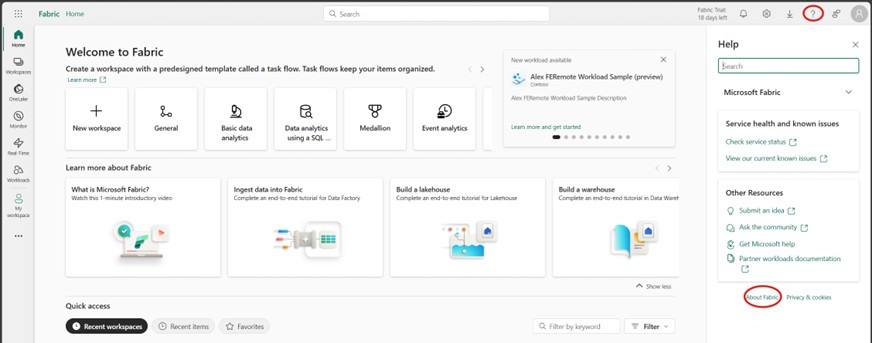
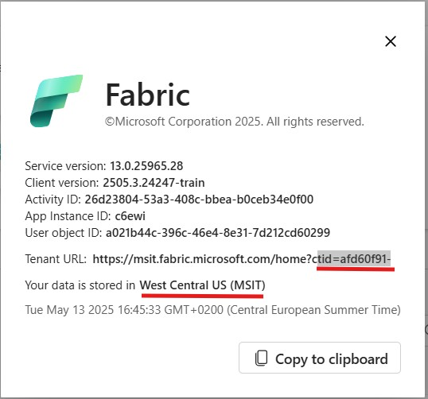
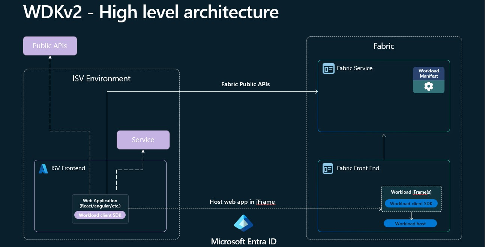

# Microsoft Fabric Software Developer Kit v2

## About the Workload Development Kit v2

The Workload Development Kit v2 (WDK v2) builds upon the foundation established by v1, addressing key gaps and introducing new capabilities to streamline workload development for Microsoft Fabric. The primary focus of v2 is on standardization, making it easier and faster for organizations to create and deploy workloads.

### Key Improvements in WDK v2

- **Standardization:** v2 introduces more consistent patterns and practices, reducing ambiguity and simplifying the development process.
- **Accelerated Development:** Enhanced tooling and templates help organizations get started quickly and reduce time-to-market for new workloads.
- **Expanded Hosting Options:** In addition to the existing Remote hosting type, v2 introduces a new hosting type called **FERemote**. This allows developers to focus exclusively on frontend-only workloads, significantly reducing complexity and lowering the barrier to entry for building Fabric workloads.

With these enhancements, WDK v2 empowers a broader range of developers to contribute to the Fabric ecosystem, making workload development more accessible and efficient.

### Register for Private Preview

Please send us your Tenant information (Tenant ID + Tenant Region) over e-mail to [Fabric workload dev support](mailto:ILDCWLSupport@microsoft.com) with the subject “WDKv2 Private Preview Onboarding”. 

### How to Find Your Tenant Information

To register for the private preview, you will need your Tenant ID and Tenant Region. Follow these steps to locate this information in Microsoft Fabric:

1. Open Microsoft Fabric and click on your profile picture in the top right corner.
2. Select **About** from the dropdown menu.
3. In the About dialog, you will find your Tenant ID and Tenant Region.

*Figure: Accessing the About dialog in Microsoft Fabric.*

*Figure: Locating Tenant ID and Tenant Region in the About dialog.*

## FERemote vs. Remote Hosting Types

WDKv2 introduces a new hosting type called **FERemote**, in addition to the existing **Remote** hosting type. The main difference is that **FERemote** only requires a frontend application, making it ideal for frontend-only workloads. FERemote workloads can still access various backend APIs—including Fabric APIs, public APIs, or proprietary APIs—directly from the frontend.

However, there are scenarios where the **Remote** hosting type is required:
- If your APIs needs to access Fabric using an On-Behalf-Of (OBO) user token, you must use **Remote** hosting to handle the necessary token exchange.
- If your workload needs to perform long-running operations (such as background processing) when the user is not active in the UI, only **Remote** hosting supports scheduling these operations to a backend service using the Fabric scheduler.

Choose **FERemote** for simpler, frontend-focused workloads, and **Remote** when backend integration or advanced scheduling is required.

At the moment only **FERemote** workloads are supported for WDKv2. We are working to make the functionallity availalbe for **Remote** workloads as well. Once the functionallity is available it will be streight forward for you to move to the new hosting type by changing the type in the type in the manifest, adding the neceseary configuration for Entra and implementing the Backend.

### High level architecture

*Figure: High level Architecture for FERemote hosting type.*

*Figure: The new high-level architecture for FERemote workloads in WDKv2. This diagram illustrates the streamlined, frontend-only approach enabled by FERemote, allowing developers to build and deploy workloads that interact directly with APIs from the frontend without requiring backend components.*

*Figure: High level Architecture for Remote hosting type.*

*Figure: The high-level architecture for Remote workloads in WDKv2. 

This diagram represents how existing WDKv1 workloads that require backend components can envision their future migration path. As WDKv2 evolves to support Remote hosting, workloads with backend dependencies will be able to leverage the new capabilities while maintaining necessary backend integrations.*

## Main new functionallity

WDKv2 introduces a suite of new capabilities designed to simplify and enhance workload development for Microsoft Fabric. These features enable developers to build richer, more integrated experiences with less effort. With WDKv2, you can easily access Fabric APIs directly from the frontend, persist item state within Fabric, leverage a standardized item creation flow, and take advantage of improved security and interoperability through IFrame relaxation and public API support. Additionally, WDKv2 streamlines your development lifecycle with built-in CI/CD support, making it easier to automate deployment and testing. The following sections provide an overview of each new functionality and guidance on how to incorporate them into your workloads.

To see how you can interact with the new functaionallity take a look into the [WDKv2-How-To Guide](WDKv2-How-To.md)

For detailed setup instructions, please refer to the [WDKv2 Setup Guide](./WDKv2-Setup.md).

### Frontend API access

With WDKv2, you can obtain an Entra On-Behalf-Of (OBO) token directly within your frontend application, enabling secure access to any Entra-protected API. This capability allows you to deeply integrate with Microsoft Fabric services—for example, you can read and store data in OneLake, create and interact with other Fabric items, or leverage Spark as a processing engine via the Livey APIs. For more details, see the [Microsoft Entra documentation](https://learn.microsoft.com/entra/), [OneLake documentation](https://learn.microsoft.com/fabric/onelake/overview), [Fabric REST APIs](https://learn.microsoft.com/rest/api/fabric/), and [Spark in Fabric](https://learn.microsoft.com/fabric/data-engineering/spark-overview).

### Storing Item state in Fabric

This feature enables you to store your item's metadata—such as state, configuration, and other relevant information—directly in OneLake within a hidden folder that is not visible to end users. The data is stored using the same format leveraged by public APIs and CI/CD processes, ensuring consistency and interoperability across different integration points. Details about the format and its use with public APIs and CI/CD will be discussed in the following sections.

### Standard Item creation experience

With WDKv2, item creation is standardized through a dedicated Fabric control that guides users through the process. This control allows users to select the workspace where the item will be created, assign Sensitivity labels, and configure other relevant settings. By using this standardized experience, you no longer need to handle the complexities of item creation yourself or worry about future changes to the process. Additionally, this approach enables item creation to be surfaced directly within your workload page, providing a seamless and integrated user experience.

### IFrame Relaxation

With WDKv2, partners can request additional IFrame attributes to enable advanced scenarios such as file downloads or opening external websites. This feature allows your workload to prompt users for explicit consent before performing actions that require broader browser capabilities—such as initiating downloads or connecting users to external APIs using their current Fabric credentials. By specifying these requirements in your workload configuration, you ensure that users are informed and can grant the necessary permissions, enabling seamless integration with external systems while maintaining security and user trust.  
**Note**: Enabling this feature requires users to grant additional AAD consent for the relaxation scope, beyond the standard Fabric scope required for basic workload functionality.

### Public API Support

With WDKv2, users can create, update, and delete items with content using the standard Fabric APIs. This automatic enablement makes it much easier to integrate with extension items in the same way as core Fabric items, streamlining interoperability and reducing the effort required to build robust integrations.

### CI/CD Support

CI/CD support for all items is one of the highest asks from our customers. With this feature, WDKv2 enables CI/CD support for all items out of the box, without the need to implement any specific logic or backend operations. This means you can automate deployment, testing, and updates for your workloads using standard DevOps pipelines and tools. The item format and APIs are designed to be fully compatible with CI/CD processes, ensuring a consistent and reliable experience across environments. For more information on integrating with CI/CD, refer to the [Fabric DevOps documentation](https://learn.microsoft.com/fabric/devops/).
