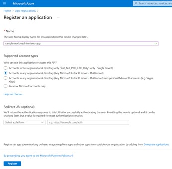
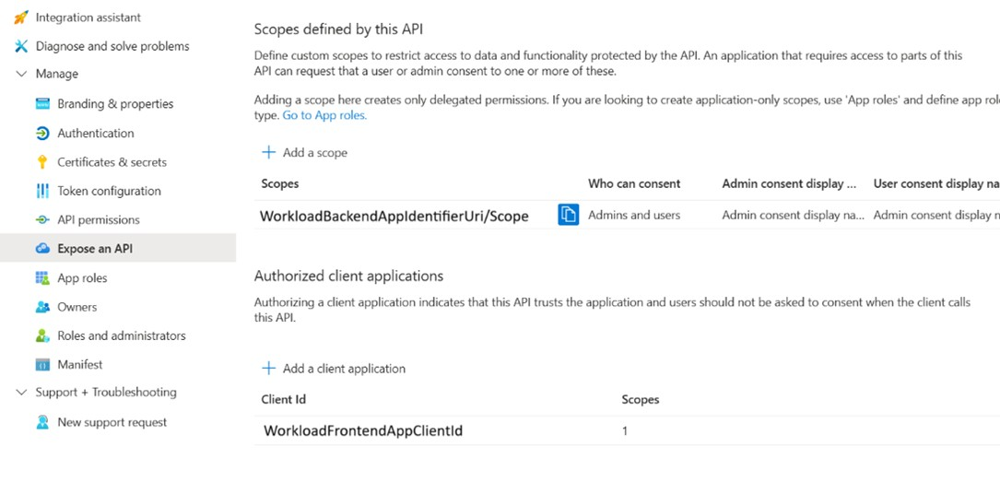

# Getting Started with WDKv2

In this section we will present all of the necessary steps to get started with the newest version of our Workload Development Kit.

## Register for Private Preview

You are viewing the private preview of the WDKv2. Before you begin, be sure to [register your tenant](/docs/WDKv2-Introduction.md#register-for-private-preview) for private preview.

We look forward to hearing your feedback and good luck!

## Setup your workload

First things first, let's make sure you have a workload setup. 

For this we have provided scripts that will help you set everything up in the [Scripts/Setup](./scripts/Setup/) folder of this repository. 

The easiest way to get startet is by running the [Setup.ps1](./scripts/Setup/Setup.ps1) Script in your local repository with your configuration parameters.

```
.\Setup.ps1 -WorkloadName "Org.MyWorkloadSample" -ItemName "SampleItem" -AADFrontendAppId "00000000-0000-0000-0000-000000000000" -WorkspaceId "00000000-0000-0000-0000-000000000000"
```

After that follow the guidance the script is providing you. 


## Setup your workload manually

If you are new to the Workload Development Kit, follow our [setup instructions](https://learn.microsoft.com/en-us/fabric/workload-development-kit/environment-setup) before you proceed to ensure you have the prerequisites that you need to continue. Then, clone this version of the WDK.


### Register a Frontend Entra Application:

You can leverage the [CreateDevAADApp.ps1](./../scripts/Setup/CreateDevAADApp.ps1) to create a new Entra app or you can follow the steps below. 


1. Navigate to App registrations in the [Azure Admin Portal](https://entra.microsoft.com/?culture=en-us&country=us#view/Microsoft_AAD_IAM/StartboardApplicationsMenuBlade/~/AppAppsPreview).
2. Create a new Multitenant application.

    
4. Add the following SPA redirectURIs to the application manifest:

a. https://app.fabric.microsoft.com/workloadSignIn/{publisherTenantId}/{workloadId}

b. https://app.powerbi.com/workloadSignIn/{publisherTenantId}/{workloadId}

c. https://msit.fabric.microsoft.com/workloadSignIn/{publisherTenantId}/{workloadId}

d. https://msit.powerbi.com/workloadSignIn/{publisherTenantId}/{workloadId}

You can find your Workload ID in the `WorkloadManifest.xml` as the value `WorkloadName`.

Looking for your Tenant ID? Follow these steps:

1. Open Microsoft Fabric and click on your profile picture in the top right corner.
2. Select **About** from the dropdown menu.
3. In the About dialog, you will find your Tenant ID and Tenant Region.


*Figure: Accessing the About dialog in Microsoft Fabric.*


*Figure: Locating Tenant ID and Tenant Region in the About dialog.*
 
### Configure your Workload to use the Frontend App: 

The next step is to configure your workload to make use of the new Frontend App. 

1.	Open the “Frontend/.env.dev” file and insert your workload name in the “WORKLOAD_NAME” configuration property and your frontend application client id in the “DEV_AAD_FE_CONFIG_APPID” configuration property.
2.	Run `npm install`

### Change the Workload Manifest:

1.	Open the “WorkloadManifest.xml”
2.	Make sure the  workload manifest “schemaVersion” is “2.000.0”.
3.	Make sure the HostingType is “FERemote”
4.	Under the “CloudServiceConfiguration”, add an “AADFEApp” element with an “AppId” of the workload frontend Entra application.
 

## Test your workload

### Run your workload:
After you have completed all of the above steps, you are ready to test the workload. 
Start the workload in development mode: 
1.	Run `npm start` from within the Frontend folder
1.	Navigate to the Fabric portal. Head to the Admin Portal settings and enable the following tenant settings:
  
2.	Navigate to the Fabric Developer Settings and enable the Fabric Developer Mode:
   
4. Find the [`config/DevGateway/workload-dev-mode.json`](../config/DevGateway/workload-dev-mode.json) file. Fill in `ManifestPackageFilePath` with the path to your project directory and the `WorkspaceGuid`.	
5. Start the Development Gateway:

[!NOTE]
>If you're not using Windows, you might find it easier to run the DevGateway in a Docker container as described in [DevGateway Container](https://github.com/microsoft/Microsoft-Fabric-workload-development-sample/blob/main/tools/DevGatewayContainer/README.md).

    1. Open **PowerShell** and navigate to the **DevGateway** folder.

    2. Run the command: 
    .\Microsoft.Fabric.Workload.DevGateway.exe -DevMode:<absolute_path_to_workload-dev-mode.json>

    When the output shows the message *info: DevGateway started*. the workload is running successfully.
    

### Test the Frontend Application: 
In this version of our WDK sample, there is a component that will generate a FE Token to access the APIs. To try this out:
 
1.	Navigate to `https://app.fabric.microsoft.com/workloads/<WORKLOAD_NAME>/client-sdk-playground`
2.	Open the “Frontend Authentication (Private-Preview)” tab
6.	To acquire a token for OneLake, request for the “https://storage.azure.com/user_impersonation” scope.

  
 
7.	After successfully acquiring the token, it can be used to target one OneLake APIs, for example, to retrieve the list of folders created for a certain item in OneLake use the following API – GET https://onelake.dfs.fabric.microsoft.com/{workspaceId}?directory={ItemId}&resource=filesystem&recursive=false
 
  


## Workload BE Preauthorization (optional):

If you would like the workload frontend app to generate tokens targeting a workload backend app, the workload frontend app must be preauthorized by the workload backend app with the relevant scopes.
1.	Navigate to App registrations in the Azure Portal.
2.	Navigate to the Workload Backend app registration.
3.	Navigate to “Expose an API”.
4.	Click “Add a scope” to add a new scope that will be targeted in the workload frontend token request.
5.	Click “Add a client application”, insert the Client Id of the workload frontend app registration, and select the new scope from the previous stage to preauthorize the Workload Frontend Application with this scope.  

 

 
