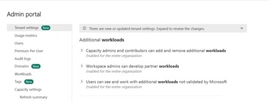

# Getting Started with WDKv2

In this section we will present all of the necessary steps to get started with the newest version of our Workload Development Kit.

## Register for Private Preview

You are viewing the private preview of the WDKv2. Before you begin, be sure to [register your tenant](/docs/WDKv2-Introduction.md#register-for-private-preview) for private preview.

We look forward to hearing your feedback and good luck!

## Setup your workload

To make it easy as possible we have created a [Setup.ps1](./scripts/Setup/Setup.ps1) script that will do all the work for you. This will replace all the manual steps that we are discribing in the next section. The setup script can e run without any parameters. While running it will ask you about the parameters that it nees to configure everything. You can specify certain parameters (see example below) in case you alreay have an existing Entra App or you want to change the default values like the Workload or item name.

```
.\Setup.ps1 -WorkloadName "Org.MyWorkloadSample" -ItemName "SampleItem" -AADFrontendAppId "00000000-0000-0000-0000-000000000000" -WorkspaceId "00000000-0000-0000-0000-000000000000"
```

After the script finished successfully your enviroment is configured and ready to go. The Script will provide you with addtional information on the next steps to see your Workload light up in Fabric.

### Error handling

In case you are getting an error similar to the one below please make sure you have the latest Powershell installed and configured in the enviroment you run the script. 


## Start your development enviroment

After you have completed all of the above steps, you are ready to test the workload.
Start the workload in development mode:
1.Run [StartFrontend.ps1](../scripts/Run/StartFrontend.ps1) to start the Frontend
2.Run [StartDevGateway.ps1](../scripts/Run/StartDevGateway.ps1) to register your local development instance with Fabric
3.Navigate to the Fabric portal. Head to the Admin Portal settings and enable the following tenant settings:
  
4.Navigate to the Fabric Developer Settings and enable the Fabric Developer Mode:
   

You are ready to go to create your first Hello World Item in Fabric.

[!NOTE]
>If you're not using Windows, you might find it easier to run the DevGateway in a Docker container as described in [DevGateway Container](../tools/DevGatewayContainer/README.md).

    1.Open **PowerShell** and navigate to the **DevGateway** folder.
    2.Run the command: 
    .\Microsoft.Fabric.Workload.DevGateway.exe -DevMode:<absolute_path_to_workload-dev-mode.json>
    When the output shows the message *info: DevGateway started*. the workload is running successfully.

After this step you are all set to start creating your own item in Fabric.

## Access your workload

To access your workload follow the steps below:
 
1.Navigate to `https://app.fabric.microsoft.com/workloadhub/detail/<WORKLOAD_NAME>?experience=fabric-developer`
2.Click the Hello World item type on the left
3.Select the development Workspace you have configured before to create the item in the dialog
4.Your item is created in Fabric

Congratulations! You have created your first item from your development enviroment

## Start changing the workload

Now that you are all set you can start following your own item ideas. For this you can either change the [HelloWorldItemEditor.tsx](../Frontend/src/workload/items/HelloWorldItem/HelloWorldItemEditor.tsx) or you can use the [CreateNewItem.ps1](../scripts/Setup/CreateNewItem.ps1) to create a new item.

Happy coding! 🚀
